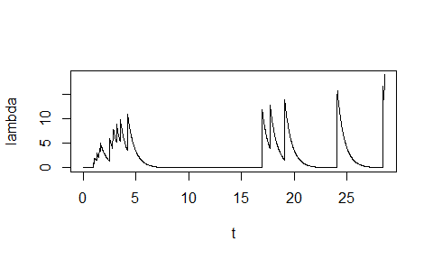

Basic example
================
2017-09-06

### Install pacakge

To install `mhawkes` package, first install `devtools`.

``` r
# install.packages("devtools")  #if devtools is not installed
```

Install `mhawkes` package from github.

``` r
# devtools::install_github("ksublee/mhawkes")
```

Load `mhawkes`.

``` r
library("mhawkes")
```

Let's start with simple example. For exemplary purposes, one can simulate a one dimensional Hawkes model by simply calling `mhsim`.

``` r
mhsim()
```

    ## ------------------------------------------
    ## Simulation result of marked Hawkes model.
    ## 1-dimensional (marked) Hawkes model with linear impact function.
    ## The intensity process is defined by
    ## LAMBDA(t) = MU + int ALPHA %/% BETA (1+(k-1)ETA) %*% exp(-BETA(t-u)) d N(t)
    ## 
    ## Parameters: 
    ## MU: 
    ## [1] 0.2
    ## ALPHA: 
    ## [1] 1.5
    ## BETA: 
    ## [1] 2
    ## ETA: 
    ## [1] 0
    ## Mark distribution: 
    ## function(n,...) rep(1,n)
    ## <environment: 0x0000000006107ad0>
    ## ------------------------------------------
    ## Realized path (with right continuous representation):
    ##        arrival N1 lambda1 lambda11
    ##  [1,]  0.00000  0  0.5000   0.3000
    ##  [2,]  0.91555  1  1.7481   1.5481
    ##  [3,]  0.97066  2  3.0865   2.8865
    ##  [4,]  0.98789  3  4.4887   4.2887
    ##  [5,]  1.27244  4  4.1276   3.9276
    ##  [6,]  6.77901  5  1.7001   1.5001
    ##  [7,]  7.08049  6  2.5208   2.3208
    ##  [8,]  7.56511  7  2.5805   2.3805
    ##  [9,]  7.78339  8  3.2384   3.0384
    ## [10,]  7.81724  9  4.5395   4.3395
    ## [11,]  8.77715 10  2.3363   2.1363
    ## [12,]  9.02386 11  3.0043   2.8043
    ## [13,]  9.34999 12  3.1607   2.9607
    ## [14,] 10.58562 13  1.9501   1.7501
    ## [15,] 11.15978 14  2.2551   2.0551
    ## [16,] 11.24885 15  3.4197   3.2197
    ## [17,] 13.91031 16  1.7157   1.5157
    ## [18,] 24.93236 17  1.7000   1.5000
    ## [19,] 25.04863 18  2.8888   2.6888
    ## [20,] 26.25849 19  1.9392   1.7392
    ## ... with 980 more rows 
    ## ------------------------------------------

The default parameters are set to be `MU <- 0.2`, `ALPHA <- 1.5` and `BETA <- 2`.

### One dimensional Hawkes process

This subsection explaines how to construct, simulate, and estimate a one dimensional Hawkes model. Basically the model can be defined up to 9 dimension but currently fully supported for one and two diemsional model. More precisely, the simulation works well for high dimension, but for estimation procedure, one or two dimesnional model is recommended.

First, create a `mhspec` which defines the Hawkes model. S4 class `mhspec` contains slots of model parameters, `MU`, `ALPHA`, `BETA`, `ETA` and `mark`.

The parameters of the model, the slots of `mhspec`, is defined by matrices but setting as numeric values are also supported for one dimesional model. For higher model, the parameters should be defined by matrices.

The following is an example of one dimensional Hawkes model (without mark). Parameter inputs can be a numeric value or 1-by-1 matrix. The simulation speed with a numeric valued parameter is little bit faster than the 1 by 1 matrix parameters. In the following case, `mark` and `ETA` slots, which deteremine the mark size and impact, are ommited and set to be default values.

``` r
set.seed(1107)
MU1 <- 0.3
ALPHA1 <- 1.5
BETA1 <- 2
mhspec1 <- new("mhspec", MU=MU1, ALPHA=ALPHA1, BETA=BETA1)
show(mhspec1)
```

    ## 1-dimensional (marked) Hawkes model with linear impact function.
    ## The intensity process is defined by
    ## LAMBDA(t) = MU + int ALPHA %/% BETA (1+(k-1)ETA) %*% exp(-BETA(t-u)) d N(t)
    ## 
    ## Parameters: 
    ## MU: 
    ## [1] 0.3
    ## ALPHA: 
    ## [1] 1.5
    ## BETA: 
    ## [1] 2
    ## ETA: 
    ## [1] 0
    ## Mark distribution: 
    ## function(n,...) rep(1,n)
    ## <environment: 0x0000000006ae2aa8>
    ## ------------------------------------------

To simulate a path, use function `mhsim`, where `n` is the number of observations.

``` r
res1 <- mhsim(mhspec1,  n=5000)
```

The output `res1` is an S3-object of `mhreal` and a list of `inter_arrival`, `arrival`, `mark_type`, `mark`,`N`, `Ng`, `lambda`, and `lambda_component`. Among those `inter_arrival`, `arrival`, `mark_type`, and `mark` are numeric vectors and `N`, `Ng`, `lambda`, and `lambda_component` are matrices.

| slot               | meaning                                 |
|--------------------|-----------------------------------------|
| `inter_arrival`    | inter-arrival between events            |
| `arrival`          | cumulative sum of `inter_arrival`       |
| `mark_type`        | the dimension of realized mark          |
| `mark`             | the size of mark                        |
| `N`                | the realization of Hawkes processs      |
| `Ng`               | the ground process                      |
| `lambda`           | the intenisty process                   |
| `lambda_component` | each component of the intensity process |

Print the result

``` r
res1
```

    ## ------------------------------------------
    ## Simulation result of marked Hawkes model.
    ## 1-dimensional (marked) Hawkes model with linear impact function.
    ## The intensity process is defined by
    ## LAMBDA(t) = MU + int ALPHA %/% BETA (1+(k-1)ETA) %*% exp(-BETA(t-u)) d N(t)
    ## 
    ## Parameters: 
    ## MU: 
    ## [1] 0.3
    ## ALPHA: 
    ## [1] 1.5
    ## BETA: 
    ## [1] 2
    ## ETA: 
    ## [1] 0
    ## Mark distribution: 
    ## function(n,...) rep(1,n)
    ## <environment: 0x0000000006ae2aa8>
    ## ------------------------------------------
    ## Realized path (with right continuous representation):
    ##        arrival N1 lambda1 lambda11
    ##  [1,]  0.00000  0  0.7500   0.4500
    ##  [2,]  0.97794  1  1.8636   1.5636
    ##  [3,]  1.09001  2  3.0497   2.7497
    ##  [4,]  1.26335  3  3.7441   3.4441
    ##  [5,]  1.47511  4  4.0550   3.7550
    ##  [6,]  1.57802  5  4.8565   4.5565
    ##  [7,]  2.44607  6  2.6029   2.3029
    ##  [8,]  2.74511  7  3.0663   2.7663
    ##  [9,]  2.80163  8  4.2706   3.9706
    ## [10,]  3.08066  9  4.0725   3.7725
    ## [11,]  3.43946 10  3.6407   3.3407
    ## [12,]  4.43428 11  2.2568   1.9568
    ## [13,] 17.17824 12  1.8000   1.5000
    ## [14,] 17.92727 13  2.1353   1.8353
    ## [15,] 19.31365 14  1.9147   1.6147
    ## [16,] 24.27426 15  1.8001   1.5001
    ## [17,] 24.30328 16  3.2155   2.9155
    ## [18,] 28.61245 17  1.8005   1.5005
    ## [19,] 28.72214 18  3.0049   2.7049
    ## [20,] 28.75173 19  4.3495   4.0495
    ## ... with 4980 more rows 
    ## ------------------------------------------

Or, use summary function.

``` r
summary(res1)
```

    ## ------------------------------------------
    ## Simulation result of marked Hawkes model.
    ## Realized path (with right continuous representation):
    ##        arrival N1 lambda1
    ##  [1,]  0.00000  0  0.7500
    ##  [2,]  0.97794  1  1.8636
    ##  [3,]  1.09001  2  3.0497
    ##  [4,]  1.26335  3  3.7441
    ##  [5,]  1.47511  4  4.0550
    ##  [6,]  1.57802  5  4.8565
    ##  [7,]  2.44607  6  2.6029
    ##  [8,]  2.74511  7  3.0663
    ##  [9,]  2.80163  8  4.2706
    ## [10,]  3.08066  9  4.0725
    ## [11,]  3.43946 10  3.6407
    ## [12,]  4.43428 11  2.2568
    ## [13,] 17.17824 12  1.8000
    ## [14,] 17.92727 13  2.1353
    ## [15,] 19.31365 14  1.9147
    ## [16,] 24.27426 15  1.8001
    ## [17,] 24.30328 16  3.2155
    ## [18,] 28.61245 17  1.8005
    ## [19,] 28.72214 18  3.0049
    ## [20,] 28.75173 19  4.3495
    ## ... with 4980 more rows 
    ## ------------------------------------------

Note that the `inter_arrival`, `arrival`, `Ng` and `N` start at zero. Thus, `inter_arrival[2]` and `arrival[2]` are first arrival times of event. Since the model is the Hawkes process without mark, `Ng` and `N` are equal. `Ng` is the ground process, a counting process without mark and hence only counts the number of events. In a one dimensional model, `lambda = mu + lambda_component`. About `lambda_component` in higher-order models are discussed in the next subsection.

Simle way to plot the realized processes:

``` r
plot(res1$arrival[1:20], res1$N[,'N1'][1:20], 's', xlab="t", ylab="N")
```


Intensity process can be plotted by `plot_lambda` function. Note that `BETA` is provided to describe the exponential decaying.

``` r
plot_lambda(res1$arrival[1:20], res1$N[,'N1'][1:20], BETA1)
```



The log-likelihood function is computed by `logLik` method. In this case, the inter-arrival times and `mhspec` are inputs of the function.

``` r
logLik(mhspec1, inter_arrival = res1$inter_arrival)
```

    ## [1] -731.6849

The likelihood estimation is performed using `mhfit` function. The specification of the initial values of the parameters, `mhspec0` is needed. In the following example, `mhspec0` is set to be `mhspec1`, which is defined previously, for simplicity, but any candidates for the starting value of the numerical procedure can be used.

Note that only `arrival` or `inter_arrival` is needed. (Indeed, for more precise simulation, `LAMBDA0`, the inital value of lambda compoment, should be specified. If not, internally determined initial values are set.)

``` r
mhspec0 <- mhspec1
mle <- mhfit(mhspec0, inter_arrival = res1$inter_arrival)
summary(mle)
```

    ## --------------------------------------------
    ## Maximum Likelihood estimation
    ## BFGS maximization, 29 iterations
    ## Return code 0: successful convergence 
    ## Log-Likelihood: -730.7424 
    ## 3  free parameters
    ## Estimates:
    ##        Estimate Std. error t value Pr(> t)    
    ## mu1     0.29768    0.01242   23.96  <2e-16 ***
    ## alpha1  1.48370    0.05591   26.54  <2e-16 ***
    ## beta1   1.93717    0.06900   28.08  <2e-16 ***
    ## ---
    ## Signif. codes:  0 '***' 0.001 '**' 0.01 '*' 0.05 '.' 0.1 ' ' 1
    ## --------------------------------------------

One can omitt `mhspec` but it is recommended that you provide a starting values.

``` r
summary(mhfit(inter_arrival = res1$inter_arrival))
```

    ## --------------------------------------------
    ## Maximum Likelihood estimation
    ## BFGS maximization, 53 iterations
    ## Return code 0: successful convergence 
    ## Log-Likelihood: -730.7424 
    ## 3  free parameters
    ## Estimates:
    ##        Estimate Std. error t value Pr(> t)    
    ## mu1     0.29768    0.01243   23.95  <2e-16 ***
    ## alpha1  1.48370    0.05149   28.81  <2e-16 ***
    ## beta1   1.93717    0.06411   30.21  <2e-16 ***
    ## ---
    ## Signif. codes:  0 '***' 0.001 '**' 0.01 '*' 0.05 '.' 0.1 ' ' 1
    ## --------------------------------------------

Note that for the numerical procedure, `maxLik` function of `maxLik` package is used with `BFGS` method. Any method supported by `maxLik` can be used.

``` r
summary(mhfit(mhspec0, inter_arrival = res1$inter_arrival, method = "NR"))
```

    ## --------------------------------------------
    ## Maximum Likelihood estimation
    ## Newton-Raphson maximisation, 4 iterations
    ## Return code 2: successive function values within tolerance limit
    ## Log-Likelihood: -730.7424 
    ## 3  free parameters
    ## Estimates:
    ##        Estimate Std. error t value Pr(> t)    
    ## mu1     0.29767    0.01237   24.07  <2e-16 ***
    ## alpha1  1.48365    0.05340   27.79  <2e-16 ***
    ## beta1   1.93711    0.06601   29.34  <2e-16 ***
    ## ---
    ## Signif. codes:  0 '***' 0.001 '**' 0.01 '*' 0.05 '.' 0.1 ' ' 1
    ## --------------------------------------------

### One dimensional Hawkes process with mark

Mark structure can be added with `mark` slot in `mhspec`. `mark` slot is a function that generates marks. Marks can be constants or random variables. In addition, linear impact parameter `ETA` can be added. The linear impact function means that when the realized jump size is `k`, then the impact is porpotional to `1 +(k-1)ETA`. In the following, the mark follows geometric distribution.

``` r
ETA1 <- 0.15
mark1 <- function(n,...) rgeom(n, 0.65) + 1
mhspec1 <- new("mhspec", MU=MU1, ALPHA=ALPHA1, BETA=BETA1, ETA=ETA1, mark=mark1)
```

``` r
res1 <- mhsim(mhspec1,  n=10)
```

    ## Warning in .local(object, ...): The initial values for intensity processes are not provided. Internally determined initial values are set.

Plot the realized processes.

``` r
# plot(res1$arrival, res1$N[,'N1'], 's', xlab="t", ylab="N")
```

### Two-dimensional Hawkes model

For a simple example, one can simulate a two-dimensional Hawkes process with default setting.

``` r
mhsim(dimens=2)
```

    ## Warning in .local(object, ...): The initial values for intensity processes are not provided. Internally determined initial values are set.

    ## ------------------------------------------
    ## Simulation result of marked Hawkes model.
    ## 2-dimensional (marked) Hawkes model with linear impact function.
    ## The intensity process is defined by
    ## LAMBDA(t) = MU + int ALPHA %/% BETA (1+(k-1)ETA) %*% exp(-BETA(t-u)) d N(t)
    ## 
    ## Parameters: 
    ## MU: 
    ##      [,1]
    ## [1,]  0.2
    ## [2,]  0.2
    ## ALPHA: 
    ##      [,1] [,2]
    ## [1,]  0.7  0.9
    ## [2,]  0.9  0.7
    ## BETA: 
    ##      [,1] [,2]
    ## [1,]    2    2
    ## [2,]    2    2
    ## ETA: 
    ##      [,1] [,2]
    ## [1,]    0    0
    ## [2,]    0    0
    ## Mark distribution: 
    ## function(n,...) rep(1,n)
    ## <environment: 0x0000000006a009b8>
    ## ------------------------------------------
    ## Realized path (with right continuous representation):
    ##        arrival N1 N2 lambda1 lambda2   lambda11 lambda12   lambda21
    ##  [1,]  0.00000  0  0  1.0000 1.00000 3.5000e-01  0.45000 4.5000e-01
    ##  [2,]  0.92818  0  1  1.2250 1.02499 5.4684e-02  0.97031 7.0308e-02
    ##  [3,]  1.22360  1  1  1.4677 1.55693 7.3029e-01  0.53741 9.3894e-01
    ##  [4,]  1.35931  1  2  2.0664 1.93440 5.5670e-01  1.30967 7.1576e-01
    ##  [5,]  1.49810  1  3  2.5140 2.21399 4.2176e-01  1.89222 5.4226e-01
    ##  [6,]  1.55630  2  3  2.9597 2.89268 1.0754e+00  1.68429 1.3827e+00
    ##  [7,]  1.70694  3  3  2.9418 3.09223 1.4957e+00  1.24616 1.9230e+00
    ##  [8,]  1.91892  3  4  2.8944 2.79285 9.7885e-01  1.71556 1.2585e+00
    ##  [9,]  2.41256  4  4  1.9039 2.06606 1.0647e+00  0.63919 1.3689e+00
    ## [10,]  2.51377  5  4  2.2917 2.62412 1.5696e+00  0.52207 2.0181e+00
    ## [11,]  2.53947  5  5  3.0869 3.20267 1.4910e+00  1.39591 1.9170e+00
    ## [12,]  3.01463  5  6  2.2161 2.06087 5.7643e-01  1.43968 7.4112e-01
    ## [13,]  7.45090  5  7  1.1003 0.90026 8.0808e-05  0.90020 1.0390e-04
    ## [14,]  7.72435  5  8  1.6210 1.30527 4.6767e-05  1.42098 6.0129e-05
    ## [15,] 10.26590  5  9  1.1088 0.90685 2.8999e-07  0.90881 3.7284e-07
    ## [16,] 10.36184  5 10  1.8501 1.48344 2.3936e-07  1.65013 3.0774e-07
    ## [17,] 10.54257  5 11  2.2496 1.79412 1.6675e-07  2.04958 2.1439e-07
    ## [18,] 10.64480  6 11  2.5706 2.39935 7.0000e-01  1.67059 9.0000e-01
    ## [19,] 10.73624  7 11  2.8744 2.93175 1.2830e+00  1.39137 1.6496e+00
    ## [20,] 11.43556  7 12  1.7604 1.57457 3.1682e-01  1.24358 4.0734e-01
    ##       lambda22
    ##  [1,]  0.35000
    ##  [2,]  0.75468
    ##  [3,]  0.41799
    ##  [4,]  1.01864
    ##  [5,]  1.47172
    ##  [6,]  1.31000
    ##  [7,]  0.96923
    ##  [8,]  1.33432
    ##  [9,]  0.49715
    ## [10,]  0.40605
    ## [11,]  1.08571
    ## [12,]  1.11975
    ## [13,]  0.70016
    ## [14,]  1.10521
    ## [15,]  0.70685
    ## [16,]  1.28344
    ## [17,]  1.59412
    ## [18,]  1.29935
    ## [19,]  1.08218
    ## [20,]  0.96723
    ## ... with 980 more rows 
    ## ------------------------------------------

The default parameters are set to be `MU <- matrix(c(0.2), nrow = 2)`, `ALPHA <- matrix(c(0.7, 0.9, 0.9, 0.7), byrow=TRUE)` and `BETA <- matrix(c(2, 2, 2, 2), nrow = 2)`.

In general, the parameters, the slots of `mhspec`, are set by matrices. `MU` is 2-by-1, and `ALPHA, BETA, ETA` are 2-by-2 matrices. `mark` is a random number generatring fucntion. `LAMBDA0`, 2-by-2 matrix, represents the initial values of `lambda_component`. The intensity process is definde by

*λ*<sub>1</sub> = *μ*<sub>1</sub> + *λ*<sub>11</sub> + *λ*<sub>12</sub>
*λ*<sub>2</sub> = *μ*<sub>2</sub> + *λ*<sub>21</sub> + *λ*<sub>22</sub>
 *λ*<sub>*i**j*</sub> are lambda components and `LAMBDA0` represents *l**a**m**b**d**a*<sub>*i**j*</sub>(0).

``` r
MU2 <- matrix(c(0.2), nrow = 2)
ALPHA2 <- matrix(c(0.75, 0.92, 0.92, 0.75), nrow = 2, byrow=TRUE)
BETA2 <- matrix(c(2.25, 2.25, 2.25, 2.25), nrow = 2, byrow=TRUE)
ETA2 <- matrix(c(0.19, 0.19, 0.19, 0.19), nrow = 2, byrow=TRUE)
mark2 <- function(n,...) rgeom(n, 0.65) + 1
LAMBDA0 <- matrix(c(0.1, 0.1, 0.1, 0.1), nrow = 2, byrow=TRUE)
mhspec2 <- new("mhspec", MU=MU2, ALPHA=ALPHA2, BETA=BETA2, ETA=ETA2, mark =mark2)
```

``` r
mhspec2
```

    ## 2-dimensional (marked) Hawkes model with linear impact function.
    ## The intensity process is defined by
    ## LAMBDA(t) = MU + int ALPHA %/% BETA (1+(k-1)ETA) %*% exp(-BETA(t-u)) d N(t)
    ## 
    ## Parameters: 
    ## MU: 
    ##      [,1]
    ## [1,]  0.2
    ## [2,]  0.2
    ## ALPHA: 
    ##      [,1] [,2]
    ## [1,] 0.75 0.92
    ## [2,] 0.92 0.75
    ## BETA: 
    ##      [,1] [,2]
    ## [1,] 2.25 2.25
    ## [2,] 2.25 2.25
    ## ETA: 
    ##      [,1] [,2]
    ## [1,] 0.19 0.19
    ## [2,] 0.19 0.19
    ## Mark distribution: 
    ## function(n,...) rgeom(n, 0.65) + 1
    ## ------------------------------------------

To simulate, use function `mhsim`.

``` r
res2 <- mhsim(mhspec2,  n=5000)
```

    ## Warning in .local(object, ...): The initial values for intensity processes are not provided. Internally determined initial values are set.

``` r
summary(res2)
```

    ## ------------------------------------------
    ## Simulation result of marked Hawkes model.
    ## Realized path (with right continuous representation):
    ##       arrival N1 N2 lambda1 lambda2
    ##  [1,] 0.00000  0  0 0.77586 0.77586
    ##  [2,] 0.26175  1  0 1.26956 1.43956
    ##  [3,] 0.49763  2  0 1.57908 1.84907
    ##  [4,] 0.52694  5  0 2.52609 3.01345
    ##  [5,] 0.78295  5  1 2.42756 2.53152
    ##  [6,] 1.05382  5  4 2.68060 2.50251
    ##  [7,] 1.21040  6  4 2.69403 2.73882
    ##  [8,] 1.67777  6  5 1.99137 1.83702
    ##  [9,] 1.74205  6  6 2.67017 2.36660
    ## [10,] 1.75182  6  8 3.71123 3.21196
    ## [11,] 1.87148  6  9 3.80247 3.25105
    ## [12,] 2.17800  7  9 2.75751 2.65084
    ## [13,] 2.22966  8  9 3.22689 3.30192
    ## [14,] 5.96806  8 10 1.12067 0.95069
    ## [15,] 6.00692  9 10 1.79359 1.80784
    ## [16,] 6.00774 10 10 2.54064 2.72487
    ## [17,] 6.18180 11 10 2.53218 2.82671
    ## [18,] 6.31367 11 11 2.85342 2.90233
    ## [19,] 6.43295 11 12 3.14885 3.01624
    ## [20,] 6.68409 11 16 3.32028 2.97802
    ## ... with 4980 more rows 
    ## ------------------------------------------

Plot N.

``` r
# plot(res2$arrival[1:10], res2$N[1:10,1], 's')
```

``` r
# plot(res2)
```

Plot lambda.

``` r
# plotlambda(res2$arrival[1:10], res2$lambda[1:10,1], BETA2[1,1])
```

Frome the result, we get a vector of realized inter arrival times.

``` r
inter_arrival2 <- res2$inter_arrival
mark2 <- res2$mark
mark_type2 <- res2$mark_type
```

Log-likelihood is computed by a function `logLik`.

``` r
logLik(mhspec2, inter_arrival = inter_arrival2, mark_type = mark_type2, mark = mark2)
```

    ## [1] -2184.067

A log-likelihood estimation is performed using `mhfit`. `mhspec0` is regarded as a starting point of the numerical optimization.

``` r
mhspec0 <- mhspec2
mle <- mhfit(mhspec0, inter_arrival = inter_arrival2, mark_type = mark_type2, mark = mark2)
summary(mle)
```

    ## --------------------------------------------
    ## Maximum Likelihood estimation
    ## BFGS maximization, 44 iterations
    ## Return code 0: successful convergence 
    ## Log-Likelihood: -2183.122 
    ## 5  free parameters
    ## Estimates:
    ##         Estimate Std. error t value  Pr(> t)    
    ## mu1     0.201081   0.009826  20.464  < 2e-16 ***
    ## alpha11 0.721577   0.048074  15.010  < 2e-16 ***
    ## alpha12 0.911092   0.053861  16.916  < 2e-16 ***
    ## beta11  2.257679   0.104249  21.657  < 2e-16 ***
    ## eta11   0.196710   0.050155   3.922 8.78e-05 ***
    ## ---
    ## Signif. codes:  0 '***' 0.001 '**' 0.01 '*' 0.05 '.' 0.1 ' ' 1
    ## --------------------------------------------

One can estimate using `N` and `inter_arrival` with the same result.

``` r
summary(mhfit(mhspec0, inter_arrival = inter_arrival2, N = res2$N))
```

    ## --------------------------------------------
    ## Maximum Likelihood estimation
    ## BFGS maximization, 44 iterations
    ## Return code 0: successful convergence 
    ## Log-Likelihood: -2183.122 
    ## 5  free parameters
    ## Estimates:
    ##         Estimate Std. error t value  Pr(> t)    
    ## mu1     0.201081   0.009826  20.464  < 2e-16 ***
    ## alpha11 0.721577   0.048074  15.010  < 2e-16 ***
    ## alpha12 0.911092   0.053861  16.916  < 2e-16 ***
    ## beta11  2.257679   0.104249  21.657  < 2e-16 ***
    ## eta11   0.196710   0.050155   3.922 8.78e-05 ***
    ## ---
    ## Signif. codes:  0 '***' 0.001 '**' 0.01 '*' 0.05 '.' 0.1 ' ' 1
    ## --------------------------------------------

### Parameter setting

The parameters to be estimated depends on `mhspec0`. For example, if `ALPHA[1,1]` and `ALPHA[1,2]` in `mhspec0`are different, then both parameters are estimated. If `ALPHA[1,1]` and `ALPHA[1,2]` are equal, then two parameters are assumed to be the same and hence only one parameter is estimated.

Simulate a path to apply `mhfit`.

``` r
MU2 <- matrix(c(0.2, 0.2), nrow = 2)
ALPHA2 <- matrix(c(0.75, 0.90, 0.90, 0.75), nrow = 2, byrow=TRUE)
BETA2 <- matrix(c(2.5, 2.5, 2.5, 2.5), nrow = 2, byrow=TRUE)
ETA2 <- matrix(c(0.19, 0.19, 0.19, 0.19), nrow = 2, byrow=TRUE)
mark2 <- function(n,...) rgeom(n, 0.65) + 1

mhspec2 <- new("mhspec", MU=MU2, ALPHA=ALPHA2, BETA=BETA2, ETA=ETA2, mark =mark2)
res2 <- mhsim(mhspec2, n=1000)
```

    ## Warning in .local(object, ...): The initial values for intensity processes are not provided. Internally determined initial values are set.

In the first example, `ALPHA` is a matrix with the same element.

``` r
MU0 <- matrix(c(0.15, 0.15), nrow = 2)
ALPHA0 <- matrix(c(0.75, 0.75, 0.75, 0.75), nrow = 2, byrow=TRUE)
BETA0 <- matrix(c(2.6, 2.6, 2.6, 2.6), nrow = 2, byrow=TRUE)
ETA0 <- matrix(c(0.2, 0.2, 0.2, 0.2), nrow = 2, byrow=TRUE)
mark0 <- function(n,...) rgeom(n, 0.65) + 1

mhspec0 <- new("mhspec", MU=MU0, ALPHA=ALPHA0, BETA=BETA0, ETA=ETA0, mark =mark0)
summary(mhfit(mhspec0, arrival = res2$arrival, N = res2$N))
```

    ## --------------------------------------------
    ## Maximum Likelihood estimation
    ## BFGS maximization, 40 iterations
    ## Return code 0: successful convergence 
    ## Log-Likelihood: -949.924 
    ## 4  free parameters
    ## Estimates:
    ##         Estimate Std. error t value Pr(> t)    
    ## mu1      0.18284    0.01487  12.295  <2e-16 ***
    ## alpha11  0.75063    0.07706   9.741  <2e-16 ***
    ## beta11   2.44505    0.19879  12.300  <2e-16 ***
    ## eta11    0.27226    0.11342   2.400  0.0164 *  
    ## ---
    ## Signif. codes:  0 '***' 0.001 '**' 0.01 '*' 0.05 '.' 0.1 ' ' 1
    ## --------------------------------------------

In the second example, `ALPHA`'s elements are not same, but symmetric as in the simulation.

``` r
MU0 <- matrix(c(0.15, 0.15), nrow = 2)
ALPHA0 <- matrix(c(0.75, 0.751, 0.751, 0.75), nrow = 2, byrow=TRUE)
BETA0 <- matrix(c(2.6, 2.6, 2.6, 2.6), nrow = 2, byrow=TRUE)
ETA0 <- matrix(c(0.2, 0.2, 0.2, 0.2), nrow = 2, byrow=TRUE)
mark0 <- function(n,...) rgeom(n, 0.65) + 1

mhspec0 <- new("mhspec", MU=MU0, ALPHA=ALPHA0, BETA=BETA0, ETA=ETA0, mark =mark0)
summary(mhfit(mhspec0, arrival = res2$arrival, N = res2$N))
```

    ## --------------------------------------------
    ## Maximum Likelihood estimation
    ## BFGS maximization, 43 iterations
    ## Return code 0: successful convergence 
    ## Log-Likelihood: -948.8432 
    ## 5  free parameters
    ## Estimates:
    ##         Estimate Std. error t value  Pr(> t)    
    ## mu1      0.18347    0.01490  12.313  < 2e-16 ***
    ## alpha11  0.66809    0.08685   7.693 1.44e-14 ***
    ## alpha12  0.82859    0.09605   8.627  < 2e-16 ***
    ## beta11   2.45403    0.19434  12.627  < 2e-16 ***
    ## eta11    0.28430    0.11480   2.476   0.0133 *  
    ## ---
    ## Signif. codes:  0 '***' 0.001 '**' 0.01 '*' 0.05 '.' 0.1 ' ' 1
    ## --------------------------------------------

### Dependence structure for mark

The mark distribution may be dependent with . For example, consider a mark Hawkes model with conditional geometric distribution.

``` r
dependent_mark <- function(n, k, lambda = lambda, mark_type = mark_type, ...){
  c <- 0.15
  d <- 1
  U <- 2
  p <- 1 / min(d + c*lambda[k, mark_type[k]], U)
  rgeom(n, p) + 1
}

MU2 <- matrix(c(0.2, 0.2), nrow = 2)
ALPHA2 <- matrix(c(0.75, 0.90, 0.90, 0.75), nrow = 2, byrow=TRUE)
BETA2 <- matrix(c(2.5, 2.5, 2.5, 2.5), nrow = 2, byrow=TRUE)
ETA2 <- matrix(c(0.19, 0.19, 0.19, 0.19), nrow = 2, byrow=TRUE)

mhspec2 <- new("mhspec", MU=MU2, ALPHA=ALPHA2, BETA=BETA2, ETA=ETA2, mark=dependent_mark)
summary(res2 <- mhsim(mhspec2, n=5000))
```

    ## Warning in .local(object, ...): The initial values for intensity processes are not provided. Internally determined initial values are set.

    ## ------------------------------------------
    ## Simulation result of marked Hawkes model.
    ## Realized path (with right continuous representation):
    ##        arrival N1 N2 lambda1 lambda2
    ##  [1,]  0.00000  0  0 0.58824 0.58824
    ##  [2,]  0.13943  2  0 1.36647 1.54497
    ##  [3,]  5.30413  2  1 1.10000 0.95000
    ##  [4,]  6.07189  2  2 1.23202 1.06002
    ##  [5,]  6.71634  3  2 1.15606 1.27172
    ##  [6,] 10.46305  3  3 1.10008 0.95009
    ##  [7,] 17.78317  4  3 0.95000 1.10000
    ##  [8,] 17.86771  5  3 1.55712 1.82855
    ##  [9,] 21.32174  5  4 1.10024 0.95029
    ## [10,] 21.38342  6  4 1.72159 1.74307
    ## [11,] 21.39001  6  6 2.76774 2.61037
    ## [12,] 21.41320  6  7 3.52310 3.22459
    ## [13,] 21.42690  6  9 4.48223 4.01527
    ## [14,] 21.47677  7  9 4.73031 4.46808
    ## [15,] 21.50453  7 11 5.49749 5.07435
    ## [16,] 21.59621  7 12 5.31239 4.82592
    ## [17,] 21.67943  7 13 5.25218 4.70708
    ## [18,] 21.77110  9 13 5.10996 4.85500
    ## [19,] 21.78299 10 13 5.71612 5.61863
    ## [20,] 21.86990 13 13 5.67386 5.80241
    ## ... with 4980 more rows 
    ## ------------------------------------------

``` r
summary(mhfit(mhspec2, arrival = res2$arrival, N = res2$N))
```

    ## --------------------------------------------
    ## Maximum Likelihood estimation
    ## BFGS maximization, 41 iterations
    ## Return code 0: successful convergence 
    ## Log-Likelihood: -4467.041 
    ## 5  free parameters
    ## Estimates:
    ##         Estimate Std. error t value Pr(> t)    
    ## mu1     0.196632   0.007212  27.263 < 2e-16 ***
    ## alpha11 0.736977   0.042399  17.382 < 2e-16 ***
    ## alpha12 0.907346   0.047359  19.159 < 2e-16 ***
    ## beta11  2.469709   0.104067  23.732 < 2e-16 ***
    ## eta11   0.169692   0.061000   2.782 0.00541 ** 
    ## ---
    ## Signif. codes:  0 '***' 0.001 '**' 0.01 '*' 0.05 '.' 0.1 ' ' 1
    ## --------------------------------------------

### Impact function
