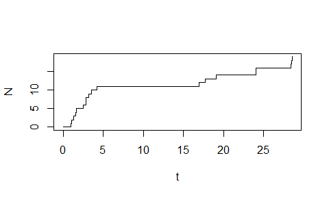

Basic example
================
Kyungsub Lee
2017-10-11

### Install package

To install `mhawkes` package, first install `devtools`.

``` r
# install.packages("devtools")  #if devtools is not installed
```

Install `mhawkes` package from github.

``` r
# devtools::install_github("ksublee/mhawkes")
```

Load `mhawkes`.

``` r
library("mhawkes")
```

Let's start with simple example. For exemplary purposes, one can simulate a one dimensional Hawkes model by simply calling `mhsim`.

``` r
mhsim()
```

    ## ------------------------------------------
    ## Simulation result of marked Hawkes model.
    ## 1-dimensional (marked) Hawkes model with linear impact function.
    ## The intensity process is defined by
    ## LAMBDA(t) = MU + int ALPHA %/% BETA (1+(k-1)ETA) %*% exp(-BETA(t-u)) d N(t)
    ## 
    ## Parameters: 
    ## MU: 
    ## [1] 0.2
    ## ALPHA: 
    ## [1] 1.5
    ## BETA: 
    ## [1] 2
    ## ETA: 
    ## [1] 0
    ## Mark distribution: 
    ## function(n,...) rep(1,n)
    ## <environment: 0x0000000008c9f310>
    ## ------------------------------------------
    ## Realized path (with right continuous representation):
    ##       arrival N1 lambda1 lambda11
    ##  [1,]  0.0000  0  0.5000   0.3000
    ##  [2,]  4.6856  1  1.7000   1.5000
    ##  [3,]  5.2877  2  2.1499   1.9499
    ##  [4,]  5.3776  3  3.3291   3.1291
    ##  [5,]  5.6209  4  3.6236   3.4236
    ##  [6,] 12.7232  5  1.7000   1.5000
    ##  [7,] 16.2287  6  1.7014   1.5014
    ##  [8,] 20.6710  7  1.7002   1.5002
    ##  [9,] 20.9340  8  2.5865   2.3865
    ## [10,] 20.9360  9  4.0774   3.8774
    ## [11,] 21.3741 10  3.3142   3.1142
    ## [12,] 23.4797 11  1.7462   1.5462
    ## [13,] 23.8176 12  2.4867   2.2867
    ## [14,] 25.1251 13  1.8673   1.6673
    ## [15,] 35.7387 14  1.7000   1.5000
    ## [16,] 35.7563 15  3.1481   2.9481
    ## [17,] 36.1050 16  3.1676   2.9676
    ## [18,] 36.2186 17  4.0647   3.8647
    ## [19,] 37.1642 18  2.2832   2.0832
    ## [20,] 47.3819 19  1.7000   1.5000
    ## ... with 980 more rows 
    ## ------------------------------------------

The model parameters are set to default with `MU = 0.2`, `ALPHA = 1.5` and `BETA = 2`. In addition, mark distribution is a constant function and all mark sizes are 1.

### One dimensional Hawkes process

This subsection explaines how to construct, simulate, and estimate a one dimensional Hawkes model. Basically the Hawkes model can be defined up to 9 dimension in this package but currently fully supported for one and two diemsional model. More precisely, the simulation works well for high dimension, but for estimation procedure, one or two dimesnional model is recommended. As the dimension increases, the parameter increases and the estimation result can not be guaranteed.

First, create a `mhspec` which defines the Hawkes model. S4 class `mhspec` contains slots of model parameters, `MU`, `ALPHA`, `BETA`, `ETA` and `mark`.

The parameters of the model, the slots of `mhspec`, is defined by matrices but setting as numeric values are also supported for one dimesional model. For more than one dimensional model, the parameters should be defined by matrices (not vectors).

The following is an example of one dimensional Hawkes model (without mark). Parameter inputs can be a numeric value or 1-by-1 matrix. The simulation by numeric values is little bit faster than the matrix-based simulation. In the following case, `mark` and `ETA` slots, which deteremine the mark size and impact of the mark, are ommited and set to be default values.

``` r
set.seed(1107)
MU1 <- 0.3; ALPHA1 <- 1.2; BETA1 <- 1.5
mhspec1 <- new("mhspec", MU=MU1, ALPHA=ALPHA1, BETA=BETA1)
show(mhspec1)
```

    ## 1-dimensional (marked) Hawkes model with linear impact function.
    ## The intensity process is defined by
    ## LAMBDA(t) = MU + int ALPHA %/% BETA (1+(k-1)ETA) %*% exp(-BETA(t-u)) d N(t)
    ## 
    ## Parameters: 
    ## MU: 
    ## [1] 0.3
    ## ALPHA: 
    ## [1] 1.2
    ## BETA: 
    ## [1] 1.5
    ## ETA: 
    ## [1] 0
    ## Mark distribution: 
    ## function(n,...) rep(1,n)
    ## <environment: 0x0000000006a5ded8>
    ## ------------------------------------------

To simulate a path, use function `mhsim`, where `n` is the number of observations.

``` r
res1 <- mhsim(mhspec1,  n=5000)
```

The output `res1` is an S3-object of `mhreal` and a list of `inter_arrival`, `arrival`, `mark_type`, `mark`,`N`, `Ng`, `lambda`, and `lambda_component`. Among those `inter_arrival`, `arrival`, `mark_type`, and `mark` are numeric vectors and `N`, `Ng`, `lambda`, and `lambda_component` are matrices.

| slot               | meaning                                 |
|--------------------|-----------------------------------------|
| `inter_arrival`    | inter-arrival between events            |
| `arrival`          | cumulative sum of `inter_arrival`       |
| `mark_type`        | the dimension of realized mark          |
| `mark`             | the size of mark                        |
| `N`                | the realization of Hawkes processs      |
| `Ng`               | the ground process                      |
| `lambda`           | the intenisty process                   |
| `lambda_component` | each component of the intensity process |

`lambda` and `lambda_component` have the following relationship: `lambda = mu + rowSum(lambda_component)`

Print the result:

``` r
res1
```

    ## ------------------------------------------
    ## Simulation result of marked Hawkes model.
    ## 1-dimensional (marked) Hawkes model with linear impact function.
    ## The intensity process is defined by
    ## LAMBDA(t) = MU + int ALPHA %/% BETA (1+(k-1)ETA) %*% exp(-BETA(t-u)) d N(t)
    ## 
    ## Parameters: 
    ## MU: 
    ## [1] 0.3
    ## ALPHA: 
    ## [1] 1.2
    ## BETA: 
    ## [1] 1.5
    ## ETA: 
    ## [1] 0
    ## Mark distribution: 
    ## function(n,...) rep(1,n)
    ## <environment: 0x0000000006a5ded8>
    ## ------------------------------------------
    ## Realized path (with right continuous representation):
    ##        arrival N1 lambda1 lambda11
    ##  [1,]  0.00000  0  0.9000   0.6000
    ##  [2,]  0.97794  1  1.6384   1.3384
    ##  [3,]  1.09001  2  2.6313   2.3313
    ##  [4,]  1.28999  3  3.2271   2.9271
    ##  [5,]  1.53225  4  3.5353   3.2353
    ##  [6,]  1.65001  5  4.2114   3.9114
    ##  [7,]  2.51807  6  2.5638   2.2638
    ##  [8,]  2.81710  7  2.9455   2.6455
    ##  [9,]  2.87547  8  3.9238   3.6238
    ## [10,]  3.16415  9  3.8502   3.5502
    ## [11,]  3.51378 10  3.6013   3.3013
    ## [12,]  4.22355 11  2.6384   2.3384
    ## [13,] 16.96752 12  1.5000   1.2000
    ## [14,] 17.71654 13  1.8902   1.5902
    ## [15,] 19.10293 14  1.6987   1.3987
    ## [16,] 24.06354 15  1.5008   1.2008
    ## [17,] 24.09256 16  2.6497   2.3497
    ## [18,] 28.40173 17  1.5037   1.2037
    ## [19,] 28.53743 18  2.4820   2.1820
    ## [20,] 28.56702 19  3.5873   3.2873
    ## ... with 4980 more rows 
    ## ------------------------------------------

Or, use summary function.

``` r
summary(res1)
```

    ## ------------------------------------------
    ## Simulation result of marked Hawkes model.
    ## Realized path (with right continuous representation):
    ##        arrival N1 lambda1
    ##  [1,]  0.00000  0  0.9000
    ##  [2,]  0.97794  1  1.6384
    ##  [3,]  1.09001  2  2.6313
    ##  [4,]  1.28999  3  3.2271
    ##  [5,]  1.53225  4  3.5353
    ##  [6,]  1.65001  5  4.2114
    ##  [7,]  2.51807  6  2.5638
    ##  [8,]  2.81710  7  2.9455
    ##  [9,]  2.87547  8  3.9238
    ## [10,]  3.16415  9  3.8502
    ## [11,]  3.51378 10  3.6013
    ## [12,]  4.22355 11  2.6384
    ## [13,] 16.96752 12  1.5000
    ## [14,] 17.71654 13  1.8902
    ## [15,] 19.10293 14  1.6987
    ## [16,] 24.06354 15  1.5008
    ## [17,] 24.09256 16  2.6497
    ## [18,] 28.40173 17  1.5037
    ## [19,] 28.53743 18  2.4820
    ## [20,] 28.56702 19  3.5873
    ## ... with 4980 more rows 
    ## ------------------------------------------

Note that the `inter_arrival`, `arrival`, `Ng` and `N` start at zero. Thus, `inter_arrival[2]` and `arrival[2]` are first arrival times of event. Since the model is the Hawkes process without mark, `Ng` and `N` are equal. `Ng` is the ground process, a counting process without mark and hence only counts the number of events. In a one dimensional model, `lambda = mu + lambda_component`. About `lambda_component` in higher-order models are discussed in the next subsection.

Simle way to plot the realized processes:

``` r
plot(res1$arrival[1:20], res1$N[,'N1'][1:20], 's', xlab="t", ylab="N")
```



Intensity process can be plotted by `plot_lambda` function. Note that `BETA` should be provided as an argument to describe the exponential decaying.

``` r
plot_lambda(res1$arrival[1:20], res1$N[,'N1'][1:20], mhspec1@BETA)
```


The log-likelihood function is computed by `logLik` method. In this case, the inter-arrival times and `mhspec` are inputs of the function.

``` r
logLik(mhspec1, inter_arrival = res1$inter_arrival)
```

    ## [1] 375.5822

The likelihood estimation is performed using `mhfit` function. The specification of the initial values of the parameters, `mhspec0` is needed. In the following example, `mhspec0` is set to be `mhspec1`, which is defined previously, for simplicity, but any candidates for the starting value of the numerical procedure can be used.

Note that only `arrival` or `inter_arrival` is needed. (Indeed, for more precise simulation, `LAMBDA0`, the inital value of lambda compoment, should be specified. If not, internally determined initial values are set.)

``` r
mhspec0 <- mhspec1
mle <- mhfit(mhspec0, inter_arrival = res1$inter_arrival)
summary(mle)
```

    ## --------------------------------------------
    ## Maximum Likelihood estimation
    ## BFGS maximization, 38 iterations
    ## Return code 0: successful convergence 
    ## Log-Likelihood: 376.853 
    ## 3  free parameters
    ## Estimates:
    ##        Estimate Std. error t value Pr(> t)    
    ## mu1     0.29038    0.01700   17.08  <2e-16 ***
    ## alpha1  1.18778    0.06814   17.43  <2e-16 ***
    ## beta1   1.44631    0.08348   17.33  <2e-16 ***
    ## ---
    ## Signif. codes:  0 '***' 0.001 '**' 0.01 '*' 0.05 '.' 0.1 ' ' 1
    ## --------------------------------------------

One can omitt `mhspec` but it is recommended that you provide a starting values.

``` r
summary(mhfit(inter_arrival = res1$inter_arrival))
```

    ## --------------------------------------------
    ## Maximum Likelihood estimation
    ## BFGS maximization, 52 iterations
    ## Return code 0: successful convergence 
    ## Log-Likelihood: 376.853 
    ## 3  free parameters
    ## Estimates:
    ##        Estimate Std. error t value Pr(> t)    
    ## mu1     0.29039    0.01548   18.76  <2e-16 ***
    ## alpha1  1.18776    0.04694   25.31  <2e-16 ***
    ## beta1   1.44629    0.05720   25.29  <2e-16 ***
    ## ---
    ## Signif. codes:  0 '***' 0.001 '**' 0.01 '*' 0.05 '.' 0.1 ' ' 1
    ## --------------------------------------------

For the numerical procedure, `maxLik` function of `maxLik` package is used with `BFGS` method. Any optimization method supported by `maxLik` can be used. In addition,

``` r
summary(mhfit(mhspec0, inter_arrival = res1$inter_arrival, method = "NR"))
```

    ## --------------------------------------------
    ## Maximum Likelihood estimation
    ## Newton-Raphson maximisation, 5 iterations
    ## Return code 2: successive function values within tolerance limit
    ## Log-Likelihood: 376.853 
    ## 3  free parameters
    ## Estimates:
    ##        Estimate Std. error t value Pr(> t)    
    ## mu1     0.29038    0.01556   18.66  <2e-16 ***
    ## alpha1  1.18778    0.04945   24.02  <2e-16 ***
    ## beta1   1.44632    0.05919   24.43  <2e-16 ***
    ## ---
    ## Signif. codes:  0 '***' 0.001 '**' 0.01 '*' 0.05 '.' 0.1 ' ' 1
    ## --------------------------------------------

### One dimensional Hawkes process with mark

Mark structure can be added with `mark` slot in `mhspec`. `mark` slot is a function that generates marks. Marks can be constants or random variables. In addition, linear impact parameter `ETA` can be added. The linear impact function means that when the realized jump size is `k`, then the impact is porpotional to `1 +(k-1)ETA`. In the following, the mark follows geometric distribution.

``` r
ETA1 <- 0.15
mark_function <- function(n,...) rgeom(n, 0.65) + 1
mhspec1 <- new("mhspec", MU=MU1, ALPHA=ALPHA1, BETA=BETA1, ETA=ETA1, mark=mark_function)
```

``` r
res1 <- mhsim(mhspec1,  n=10)
```

    ## Warning in .local(object, ...): The initial values for intensity processes are not provided. Internally determined initial values are set.

Plot the realized processes.

``` r
# plot(res1$arrival, res1$N[,'N1'], 's', xlab="t", ylab="N")
```

### Two-dimensional Hawkes model

For a simple example, one can simulate a two-dimensional Hawkes process with default setting.

``` r
mhsim(dimens=2)
```

    ## Warning in .local(object, ...): The initial values for intensity processes are not provided. Internally determined initial values are set.

    ## ------------------------------------------
    ## Simulation result of marked Hawkes model.
    ## 2-dimensional (marked) Hawkes model with linear impact function.
    ## The intensity process is defined by
    ## LAMBDA(t) = MU + int ALPHA %/% BETA (1+(k-1)ETA) %*% exp(-BETA(t-u)) d N(t)
    ## 
    ## Parameters: 
    ## MU: 
    ##      [,1]
    ## [1,]  0.2
    ## [2,]  0.2
    ## ALPHA: 
    ##      [,1] [,2]
    ## [1,]  0.7  0.9
    ## [2,]  0.9  0.7
    ## BETA: 
    ##      [,1] [,2]
    ## [1,]    2    2
    ## [2,]    2    2
    ## ETA: 
    ##      [,1] [,2]
    ## [1,]    0    0
    ## [2,]    0    0
    ## Mark distribution: 
    ## function(n,...) rep(1,n)
    ## <environment: 0x000000000c341700>
    ## ------------------------------------------
    ## Realized path (with right continuous representation):
    ##        arrival N1 N2 lambda1 lambda2   lambda11 lambda12   lambda21
    ##  [1,]  0.00000  0  0  1.0000 1.00000 3.5000e-01  0.45000 4.5000e-01
    ##  [2,]  0.92818  0  1  1.2250 1.02499 5.4684e-02  0.97031 7.0308e-02
    ##  [3,]  1.22360  1  1  1.4677 1.55693 7.3029e-01  0.53741 9.3894e-01
    ##  [4,]  1.35931  1  2  2.0664 1.93440 5.5670e-01  1.30967 7.1576e-01
    ##  [5,]  1.49810  1  3  2.5140 2.21399 4.2176e-01  1.89222 5.4226e-01
    ##  [6,]  1.55630  2  3  2.9597 2.89268 1.0754e+00  1.68429 1.3827e+00
    ##  [7,]  1.70694  3  3  2.9418 3.09223 1.4957e+00  1.24616 1.9230e+00
    ##  [8,]  1.91892  3  4  2.8944 2.79285 9.7885e-01  1.71556 1.2585e+00
    ##  [9,]  2.41256  4  4  1.9039 2.06606 1.0647e+00  0.63919 1.3689e+00
    ## [10,]  2.51377  5  4  2.2917 2.62412 1.5696e+00  0.52207 2.0181e+00
    ## [11,]  2.53947  5  5  3.0869 3.20267 1.4910e+00  1.39591 1.9170e+00
    ## [12,]  3.01463  5  6  2.2161 2.06087 5.7643e-01  1.43968 7.4112e-01
    ## [13,]  7.45090  5  7  1.1003 0.90026 8.0808e-05  0.90020 1.0390e-04
    ## [14,]  7.72435  5  8  1.6210 1.30527 4.6767e-05  1.42098 6.0129e-05
    ## [15,] 10.26590  5  9  1.1088 0.90685 2.8999e-07  0.90881 3.7284e-07
    ## [16,] 10.36184  5 10  1.8501 1.48344 2.3936e-07  1.65013 3.0774e-07
    ## [17,] 10.54257  5 11  2.2496 1.79412 1.6675e-07  2.04958 2.1439e-07
    ## [18,] 10.64480  6 11  2.5706 2.39935 7.0000e-01  1.67059 9.0000e-01
    ## [19,] 10.73624  7 11  2.8744 2.93175 1.2830e+00  1.39137 1.6496e+00
    ## [20,] 11.43556  7 12  1.7604 1.57457 3.1682e-01  1.24358 4.0734e-01
    ##       lambda22
    ##  [1,]  0.35000
    ##  [2,]  0.75468
    ##  [3,]  0.41799
    ##  [4,]  1.01864
    ##  [5,]  1.47172
    ##  [6,]  1.31000
    ##  [7,]  0.96923
    ##  [8,]  1.33432
    ##  [9,]  0.49715
    ## [10,]  0.40605
    ## [11,]  1.08571
    ## [12,]  1.11975
    ## [13,]  0.70016
    ## [14,]  1.10521
    ## [15,]  0.70685
    ## [16,]  1.28344
    ## [17,]  1.59412
    ## [18,]  1.29935
    ## [19,]  1.08218
    ## [20,]  0.96723
    ## ... with 980 more rows 
    ## ------------------------------------------

The default parameters are set to be `MU <- matrix(c(0.2), nrow = 2)`, `ALPHA <- matrix(c(0.7, 0.9, 0.9, 0.7), byrow=TRUE)` and `BETA <- matrix(c(2, 2, 2, 2), nrow = 2)`.

In general, the parameters, the slots of `mhspec`, are set by matrices. `MU` is 2-by-1, and `ALPHA, BETA, ETA` are 2-by-2 matrices. `mark` is a random number generatring fucntion. `LAMBDA0`, 2-by-2 matrix, represents the initial values of `lambda_component`. The intensity processes are represented by

*λ*<sub>1</sub>(*t*)=*μ*<sub>1</sub> + *λ*<sub>11</sub>(*t*)+*λ*<sub>12</sub>(*t*)
*λ*<sub>2</sub>(*t*)=*μ*<sub>2</sub> + *λ*<sub>21</sub>(*t*)+*λ*<sub>22</sub>(*t*)
 *λ*<sub>*i**j*</sub> are lambda components and `LAMBDA0` represents *λ*<sub>*i**j*</sub>(0).

``` r
MU2 <- matrix(c(0.2), nrow = 2)
ALPHA2 <- matrix(c(0.75, 0.92, 0.92, 0.75), nrow = 2, byrow=TRUE)
BETA2 <- matrix(c(2.25, 2.25, 2.25, 2.25), nrow = 2, byrow=TRUE)
ETA2 <- matrix(c(0.19, 0.19, 0.19, 0.19), nrow = 2, byrow=TRUE)
mark_fun <- function(n,...) rgeom(n, 0.65) + 1
LAMBDA0 <- matrix(c(0.1, 0.1, 0.1, 0.1), nrow = 2, byrow=TRUE)
mhspec2 <- new("mhspec", MU=MU2, ALPHA=ALPHA2, BETA=BETA2, ETA=ETA2, mark =mark_fun)
```

``` r
mhspec2
```

    ## 2-dimensional (marked) Hawkes model with linear impact function.
    ## The intensity process is defined by
    ## LAMBDA(t) = MU + int ALPHA %/% BETA (1+(k-1)ETA) %*% exp(-BETA(t-u)) d N(t)
    ## 
    ## Parameters: 
    ## MU: 
    ##      [,1]
    ## [1,]  0.2
    ## [2,]  0.2
    ## ALPHA: 
    ##      [,1] [,2]
    ## [1,] 0.75 0.92
    ## [2,] 0.92 0.75
    ## BETA: 
    ##      [,1] [,2]
    ## [1,] 2.25 2.25
    ## [2,] 2.25 2.25
    ## ETA: 
    ##      [,1] [,2]
    ## [1,] 0.19 0.19
    ## [2,] 0.19 0.19
    ## Mark distribution: 
    ## function(n,...) rgeom(n, 0.65) + 1
    ## ------------------------------------------

To simulate, use function `mhsim`.

``` r
res2 <- mhsim(mhspec2,  n=5000)
```

    ## Warning in .local(object, ...): The initial values for intensity processes are not provided. Internally determined initial values are set.

``` r
summary(res2)
```

    ## ------------------------------------------
    ## Simulation result of marked Hawkes model.
    ## Realized path (with right continuous representation):
    ##       arrival N1 N2 lambda1 lambda2
    ##  [1,] 0.00000  0  0 0.77586 0.77586
    ##  [2,] 0.26175  1  0 1.26956 1.43956
    ##  [3,] 0.49763  2  0 1.57908 1.84907
    ##  [4,] 0.52694  5  0 2.52609 3.01345
    ##  [5,] 0.78295  5  1 2.42756 2.53152
    ##  [6,] 1.05382  5  4 2.68060 2.50251
    ##  [7,] 1.21040  6  4 2.69403 2.73882
    ##  [8,] 1.67777  6  5 1.99137 1.83702
    ##  [9,] 1.74205  6  6 2.67017 2.36660
    ## [10,] 1.75182  6  8 3.71123 3.21196
    ## [11,] 1.87148  6  9 3.80247 3.25105
    ## [12,] 2.17800  7  9 2.75751 2.65084
    ## [13,] 2.22966  8  9 3.22689 3.30192
    ## [14,] 5.96806  8 10 1.12067 0.95069
    ## [15,] 6.00692  9 10 1.79359 1.80784
    ## [16,] 6.00774 10 10 2.54064 2.72487
    ## [17,] 6.18180 11 10 2.53218 2.82671
    ## [18,] 6.31367 11 11 2.85342 2.90233
    ## [19,] 6.43295 11 12 3.14885 3.01624
    ## [20,] 6.68409 11 16 3.32028 2.97802
    ## ... with 4980 more rows 
    ## ------------------------------------------

Plot N.

``` r
# plot(res2$arrival[1:10], res2$N[1:10,1], 's')
```

``` r
# plot(res2)
```

Plot lambda.

``` r
# plotlambda(res2$arrival[1:10], res2$lambda[1:10,1], BETA2[1,1])
```

Frome the result, we get a vector of realized inter arrival times.

``` r
inter_arrival2 <- res2$inter_arrival
mark2 <- res2$mark
mark_type2 <- res2$mark_type
```

Log-likelihood is computed by a function `logLik`.

``` r
logLik(mhspec2, inter_arrival = inter_arrival2, mark_type = mark_type2, mark = mark2)
```

    ## [1] -2184.067

A log-likelihood estimation is performed using `mhfit`. `mhspec0` is regarded as a starting point of the numerical optimization.

``` r
mhspec0 <- mhspec2
mle <- mhfit(mhspec0, inter_arrival = inter_arrival2, mark_type = mark_type2, mark = mark2)
summary(mle)
```

    ## --------------------------------------------
    ## Maximum Likelihood estimation
    ## BFGS maximization, 44 iterations
    ## Return code 0: successful convergence 
    ## Log-Likelihood: -2183.122 
    ## 5  free parameters
    ## Estimates:
    ##         Estimate Std. error t value  Pr(> t)    
    ## mu1     0.201081   0.009826  20.464  < 2e-16 ***
    ## alpha11 0.721577   0.048074  15.010  < 2e-16 ***
    ## alpha12 0.911092   0.053861  16.916  < 2e-16 ***
    ## beta11  2.257679   0.104249  21.657  < 2e-16 ***
    ## eta11   0.196710   0.050155   3.922 8.78e-05 ***
    ## ---
    ## Signif. codes:  0 '***' 0.001 '**' 0.01 '*' 0.05 '.' 0.1 ' ' 1
    ## --------------------------------------------

One can estimate using `N` and `inter_arrival` with the same result.

``` r
summary(mhfit(mhspec0, inter_arrival = inter_arrival2, N = res2$N))
```

    ## --------------------------------------------
    ## Maximum Likelihood estimation
    ## BFGS maximization, 44 iterations
    ## Return code 0: successful convergence 
    ## Log-Likelihood: -2183.122 
    ## 5  free parameters
    ## Estimates:
    ##         Estimate Std. error t value  Pr(> t)    
    ## mu1     0.201081   0.009826  20.464  < 2e-16 ***
    ## alpha11 0.721577   0.048074  15.010  < 2e-16 ***
    ## alpha12 0.911092   0.053861  16.916  < 2e-16 ***
    ## beta11  2.257679   0.104249  21.657  < 2e-16 ***
    ## eta11   0.196710   0.050155   3.922 8.78e-05 ***
    ## ---
    ## Signif. codes:  0 '***' 0.001 '**' 0.01 '*' 0.05 '.' 0.1 ' ' 1
    ## --------------------------------------------

### Parameter setting

This subsection explains about the relation between parameter setting and estimation procedure in two-dimensional Hawkes model. The number of parameters to be estimated in the model depends on how we set the parameter slots such as `ALPHA` and `BETA` in `mhspec0`, the sepcification for initial values.. Since the paremeter slot such as `ALPHA` is a matrix, and the element in the matrix can be the same or different. The number of parameters in the estimation varies depending on whether or not some of the elements in the initial setting are the same or different.

For example, if `ALPHA[1,1]` and `ALPHA[1,2]` in `mhspec0` are different, the numerical procedure tries to estimate both parameters of `ALPHA[1,1]` and `ALPHA[1,2]`. If `ALPHA[1,1]` and `ALPHA[1,2]` are the same in the initial setting, then the estimation procedure considered two parameters are the same in the model and hence only one of them is estimated.

The following is an typical example of a symmetric Hawkes model. Simulate a path first to apply `mhfit` in the later.

``` r
MU2 <- matrix(c(0.2, 0.2), nrow = 2)
ALPHA2 <- matrix(c(0.75, 0.90, 0.90, 0.75), nrow = 2, byrow=TRUE)
BETA2 <- matrix(c(2.5, 2.5, 2.5, 2.5), nrow = 2, byrow=TRUE)
ETA2 <- matrix(c(0.19, 0.19, 0.19, 0.19), nrow = 2, byrow=TRUE)
mark_function <- function(n,...) rgeom(n, 0.65) + 1

mhspec2 <- new("mhspec", MU=MU2, ALPHA=ALPHA2, BETA=BETA2, ETA=ETA2, mark = mark_function)
res2 <- mhsim(mhspec2, n=1000)
```

    ## Warning in .local(object, ...): The initial values for intensity processes are not provided. Internally determined initial values are set.

Now `res2` is the simulated path of a two dimensional Hawkes process and we want to estimate Hawkes models based on `res2`.

In the first example of estimation, `ALPHA0` is a matrix where the all elements have the same value, 0.75. In this setting, `mhfit` considers that `alpha11 == alpha12 == alpha21 == alpha22` in the model (even though the actual parameters have different values). Similarly for other parmater matrix `MU0`, `BETA0` and `ETA0`. Therefore, only four parameters `mu1, alpha11, beta11, eta11` will be estimated.

``` r
MU0 <- matrix(c(0.15, 0.15), nrow = 2)
ALPHA0 <- matrix(c(0.75, 0.75, 0.75, 0.75), nrow = 2, byrow=TRUE)
BETA0 <- matrix(c(2.6, 2.6, 2.6, 2.6), nrow = 2, byrow=TRUE)
ETA0 <- matrix(c(0.2, 0.2, 0.2, 0.2), nrow = 2, byrow=TRUE)
mark_function <- function(n,...) rgeom(n, 0.65) + 1

mhspec0 <- new("mhspec", MU=MU0, ALPHA=ALPHA0, BETA=BETA0, ETA=ETA0, mark = mark_function)
summary(mhfit(mhspec0, arrival = res2$arrival, N = res2$N))
```

    ## --------------------------------------------
    ## Maximum Likelihood estimation
    ## BFGS maximization, 40 iterations
    ## Return code 0: successful convergence 
    ## Log-Likelihood: -949.924 
    ## 4  free parameters
    ## Estimates:
    ##         Estimate Std. error t value Pr(> t)    
    ## mu1      0.18284    0.01487  12.295  <2e-16 ***
    ## alpha11  0.75063    0.07706   9.741  <2e-16 ***
    ## beta11   2.44505    0.19879  12.300  <2e-16 ***
    ## eta11    0.27226    0.11342   2.400  0.0164 *  
    ## ---
    ## Signif. codes:  0 '***' 0.001 '**' 0.01 '*' 0.05 '.' 0.1 ' ' 1
    ## --------------------------------------------

In the second example, `ALPHA0`'s elements are not same, but symmetric as in the original simulation. We have `alpha11 == alpha22` and `alpha11 == alpha22` in `ALPHA0` and hence `alpha11` and `alpha12` will be estimated.

``` r
MU0 <- matrix(c(0.15, 0.15), nrow = 2)
ALPHA0 <- matrix(c(0.75, 0.751, 0.751, 0.75), nrow = 2, byrow=TRUE)
BETA0 <- matrix(c(2.6, 2.6, 2.6, 2.6), nrow = 2, byrow=TRUE)
ETA0 <- matrix(c(0.2, 0.2, 0.2, 0.2), nrow = 2, byrow=TRUE)
mark_function <- function(n,...) rgeom(n, 0.65) + 1

mhspec0 <- new("mhspec", MU=MU0, ALPHA=ALPHA0, BETA=BETA0, ETA=ETA0, mark = mark_function)
summary(mhfit(mhspec0, arrival = res2$arrival, N = res2$N))
```

    ## --------------------------------------------
    ## Maximum Likelihood estimation
    ## BFGS maximization, 43 iterations
    ## Return code 0: successful convergence 
    ## Log-Likelihood: -948.8432 
    ## 5  free parameters
    ## Estimates:
    ##         Estimate Std. error t value  Pr(> t)    
    ## mu1      0.18347    0.01490  12.313  < 2e-16 ***
    ## alpha11  0.66809    0.08685   7.693 1.44e-14 ***
    ## alpha12  0.82859    0.09605   8.627  < 2e-16 ***
    ## beta11   2.45403    0.19434  12.627  < 2e-16 ***
    ## eta11    0.28430    0.11480   2.476   0.0133 *  
    ## ---
    ## Signif. codes:  0 '***' 0.001 '**' 0.01 '*' 0.05 '.' 0.1 ' ' 1
    ## --------------------------------------------

In the third example, all `ALPHA0` have different values and hence all `alpha11, alpha12, alpha21, alpha22` will be estimated.

``` r
MU0 <- matrix(c(0.15, 0.15), nrow = 2)
ALPHA0 <- matrix(c(0.75, 0.751, 0.752, 0.753), nrow = 2, byrow=TRUE)
BETA0 <- matrix(c(2.6, 2.6, 2.6, 2.6), nrow = 2, byrow=TRUE)
ETA0 <- matrix(c(0.2, 0.2, 0.2, 0.2), nrow = 2, byrow=TRUE)
mark_function <- function(n,...) rgeom(n, 0.65) + 1

mhspec0 <- new("mhspec", MU=MU0, ALPHA=ALPHA0, BETA=BETA0, ETA=ETA0, mark = mark_function)
summary(mhfit(mhspec0, arrival = res2$arrival, N = res2$N))
```

    ## --------------------------------------------
    ## Maximum Likelihood estimation
    ## BFGS maximization, 50 iterations
    ## Return code 0: successful convergence 
    ## Log-Likelihood: -947.4289 
    ## 7  free parameters
    ## Estimates:
    ##         Estimate Std. error t value  Pr(> t)    
    ## mu1      0.18412    0.01495  12.319  < 2e-16 ***
    ## alpha11  0.62359    0.10283   6.064 1.33e-09 ***
    ## alpha12  0.77529    0.11039   7.023 2.17e-12 ***
    ## alpha21  0.89741    0.11954   7.507 6.04e-14 ***
    ## alpha22  0.70960    0.11076   6.407 1.49e-10 ***
    ## beta11   2.46568    0.19573  12.597  < 2e-16 ***
    ## eta11    0.28266    0.11208   2.522   0.0117 *  
    ## ---
    ## Signif. codes:  0 '***' 0.001 '**' 0.01 '*' 0.05 '.' 0.1 ' ' 1
    ## --------------------------------------------

### User-defined likelihood function

Sometimes, it is better to use a user-defined likelihood function. For example, if one sure that the every element of `ETA` is equal to 0.2, and hence fix `ETA` during the estimation procedure, then the modified user defined likelihood function can be used as the following.

``` r
my_llh <- function(inter_arrival, mark_type, mark){
  
  function(param){
    MU0 <- matrix(rep(param[1], 2), nrow=2)
    ALPHA0 <- matrix(c(param[2], param[3], param[3], param[2]), nrow = 2, byrow=TRUE)
    BETA0 <- matrix(rep(param[4], 4), nrow = 2, byrow=TRUE)
    ETA0 <- matrix(rep(0.2, 4), nrow=2)
  
    mhspec0 <- new("mhspec", MU=MU0, ALPHA=ALPHA0, BETA=BETA0, ETA=ETA0)
    mhawkes::logLik(mhspec0, inter_arrival = inter_arrival, mark_type = mark_type, mark = mark)
  }
  
}

my_llh_fun <- my_llh(inter_arrival=res2$inter_arrival, mark_type=res2$mark_type, mark=res2$mark)
summary(maxLik::maxLik(logLik = my_llh_fun, 
                       start=c(mu1=0.15, alpha11=0.75, alpha12=0.8, beta=2.6), method="BFGS"))
```

    ## --------------------------------------------
    ## Maximum Likelihood estimation
    ## BFGS maximization, 33 iterations
    ## Return code 0: successful convergence 
    ## Log-Likelihood: -949.1449 
    ## 4  free parameters
    ## Estimates:
    ##         Estimate Std. error t value Pr(> t)    
    ## mu1      0.18307    0.01481  12.361  <2e-16 ***
    ## alpha11  0.70145    0.08031   8.735  <2e-16 ***
    ## alpha12  0.86224    0.09018   9.561  <2e-16 ***
    ## beta     2.46288    0.19444  12.666  <2e-16 ***
    ## ---
    ## Signif. codes:  0 '***' 0.001 '**' 0.01 '*' 0.05 '.' 0.1 ' ' 1
    ## --------------------------------------------

### Dependence structure for mark

The mark distribution may be dependent with other underlying processes. For example, consider a marked Hawkes model with conditional geometric distribution marks and the distribution depends on the current value of the intensity process. In the following, `lambda` is a matrix, and `mark_type` is a numeric vector, `i` denotes the time index.

``` r
dependent_mark <- function(n, i, lambda = lambda, mark_type = mark_type, ...){
  c <- 0.15
  d <- 1
  U <- 2
  p <- 1 / min(d + c*lambda[i, mark_type[i]], U)
  rgeom(n, p) + 1
}

MU2 <- matrix(c(0.2, 0.2), nrow = 2)
ALPHA2 <- matrix(c(0.75, 0.90, 0.90, 0.75), nrow = 2, byrow=TRUE)
BETA2 <- matrix(c(2.5, 2.5, 2.5, 2.5), nrow = 2, byrow=TRUE)
ETA2 <- matrix(c(0.19, 0.19, 0.19, 0.19), nrow = 2, byrow=TRUE)

mhspec2 <- new("mhspec", MU=MU2, ALPHA=ALPHA2, BETA=BETA2, ETA=ETA2, mark=dependent_mark)
summary(res2 <- mhsim(mhspec2, n=5000))
```

    ## ------------------------------------------
    ## Simulation result of marked Hawkes model.
    ## Realized path (with right continuous representation):
    ##        arrival N1 N2 lambda1 lambda2
    ##  [1,]  0.00000  0  0 0.58824 0.58824
    ##  [2,]  0.13943  2  0 1.36647 1.54497
    ##  [3,]  5.30413  2  1 1.10000 0.95000
    ##  [4,]  6.07189  2  2 1.23202 1.06002
    ##  [5,]  6.71634  3  2 1.15606 1.27172
    ##  [6,] 10.46305  3  3 1.10008 0.95009
    ##  [7,] 17.78317  4  3 0.95000 1.10000
    ##  [8,] 17.86771  5  3 1.55712 1.82855
    ##  [9,] 21.32174  5  4 1.10024 0.95029
    ## [10,] 21.38342  6  4 1.72159 1.74307
    ## [11,] 21.39001  6  6 2.76774 2.61037
    ## [12,] 21.41320  6  7 3.52310 3.22459
    ## [13,] 21.42690  6  9 4.48223 4.01527
    ## [14,] 21.47677  7  9 4.73031 4.46808
    ## [15,] 21.50453  7 11 5.49749 5.07435
    ## [16,] 21.59621  7 12 5.31239 4.82592
    ## [17,] 21.67943  7 13 5.25218 4.70708
    ## [18,] 21.77110  9 13 5.10996 4.85500
    ## [19,] 21.78299 10 13 5.71612 5.61863
    ## [20,] 21.86990 13 13 5.67386 5.80241
    ## ... with 4980 more rows 
    ## ------------------------------------------

``` r
summary(mhfit(mhspec2, arrival = res2$arrival, N = res2$N))
```

    ## --------------------------------------------
    ## Maximum Likelihood estimation
    ## BFGS maximization, 41 iterations
    ## Return code 0: successful convergence 
    ## Log-Likelihood: -4467.041 
    ## 5  free parameters
    ## Estimates:
    ##         Estimate Std. error t value Pr(> t)    
    ## mu1     0.196632   0.007212  27.263 < 2e-16 ***
    ## alpha11 0.736977   0.042399  17.382 < 2e-16 ***
    ## alpha12 0.907346   0.047359  19.159 < 2e-16 ***
    ## beta11  2.469709   0.104067  23.732 < 2e-16 ***
    ## eta11   0.169692   0.061000   2.782 0.00541 ** 
    ## ---
    ## Signif. codes:  0 '***' 0.001 '**' 0.01 '*' 0.05 '.' 0.1 ' ' 1
    ## --------------------------------------------

### Example with financial data

This section provides an example using financial tick data. The financial tick data is a typical example of the marked Hawkes model. The following data is a time series of stock prices traded on the New York Stock Exchange.

``` r
head(tick_price)
```

    ##         t   price
    ## [1,] 0.00 150.000
    ## [2,] 0.50 149.995
    ## [3,] 1.00 149.990
    ## [4,] 1.05 149.975
    ## [5,] 1.10 149.980
    ## [6,] 1.15 150.015

``` r
plot(tick_price[,"t"], tick_price[,"price"], 's', xlab = "t", ylab = "price")
```


The tick price process is represented by two dimenstional Hawkes process, up and down movements. The following is an estimation result of the symmetric Hawkes model.

``` r
mu <- 0.1; alpha_s <- 0.7; alpha_c = 0.5; beta <- 2

mhspec0 <- new("mhspec", MU=matrix(rep(mu,2), nrow=2), 
               ALPHA=matrix(c(alpha_s, alpha_c, alpha_c, alpha_s), nrow=2), 
               BETA=matrix(rep(beta, 4), nrow=2), 
               ETA=matrix(rep(0, 4), nrow=2))

arrival <- tick_price[, "t"]
price <- tick_price[, "price"]
mark <- c(0, abs((price[-1] - price[-length(price)])/0.005))  #0.005 is minimum tick size
mark_type <- c(0, ifelse((price[-1] - price[-length(price)]) > 0 , 1, 2))
  
mle <- mhfit(mhspec0, arrival = arrival, mark = mark, mark_type = mark_type)
summary(mle)
```

    ## --------------------------------------------
    ## Maximum Likelihood estimation
    ## BFGS maximization, 48 iterations
    ## Return code 0: successful convergence 
    ## Log-Likelihood: -15957.61 
    ## 5  free parameters
    ## Estimates:
    ##         Estimate Std. error t value  Pr(> t)    
    ## mu1      0.15881    0.00425  37.370  < 2e-16 ***
    ## alpha11  0.85730    0.05411  15.843  < 2e-16 ***
    ## alpha12  1.01420    0.07582  13.377  < 2e-16 ***
    ## beta11   2.43496    0.16275  14.961  < 2e-16 ***
    ## eta11    0.15626    0.02229   7.011 2.37e-12 ***
    ## ---
    ## Signif. codes:  0 '***' 0.001 '**' 0.01 '*' 0.05 '.' 0.1 ' ' 1
    ## --------------------------------------------

The (approximated) annualized volatility of the price process is computed by `var_diff` function. To do that, first we define a new `mhspec` from estimates by the above maximum likelihood estimation. Note that the mark distribution is defined by the empirical distribution with `sample` function.

``` r
mu <- coef(mle)["mu1"]; alpha_s <- coef(mle)["alpha11"]; alpha_c <- coef(mle)["alpha12"] 
beta <- coef(mle)["beta11"]; eta <- coef(mle)["eta11"];

mhspec_estimate <- new("mhspec", MU=matrix(rep(mu,2), nrow=2), 
               ALPHA=matrix(c(alpha_s, alpha_c, alpha_c, alpha_s), nrow=2), 
               BETA=matrix(rep(beta, 4), nrow=2), 
               ETA=matrix(rep(eta, 4), nrow=2),
               mark=function(n,empirical_mark = mark,...) sample(empirical_mark, n, replace=TRUE) )
```

In the following, `time_length=60*60*5.5*252` by assuming trading time is `60*60*5.5` seconds in a day and the busyness days are 252 days in a year. Because the volatility of return is more common than the volatiliy of price, `(0.005/mean(price))^2` is multiplied. The result 12.76% is annualised return volatility.

``` r
variance <- var_diff(mhspec_estimate, mean_jump=mean(mark), mean_jump_square=mean(mark^2), time_length=60*60*5.5*252)*(0.005/mean(price))^2
(annualized_volatility <- sqrt(variance))
```

    ## [1] 0.1276004
